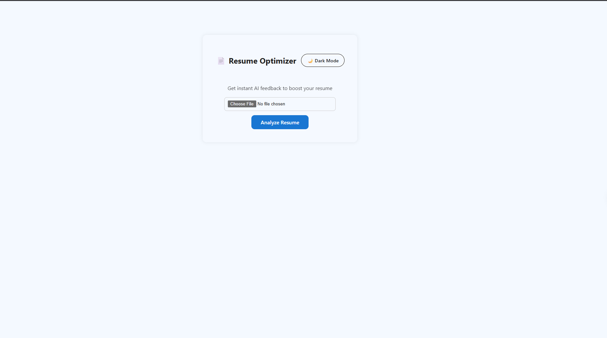
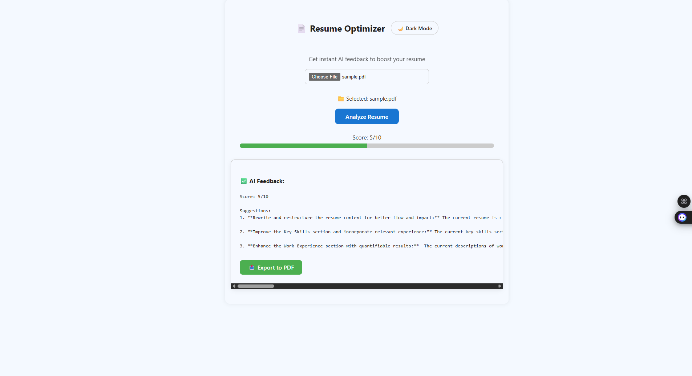
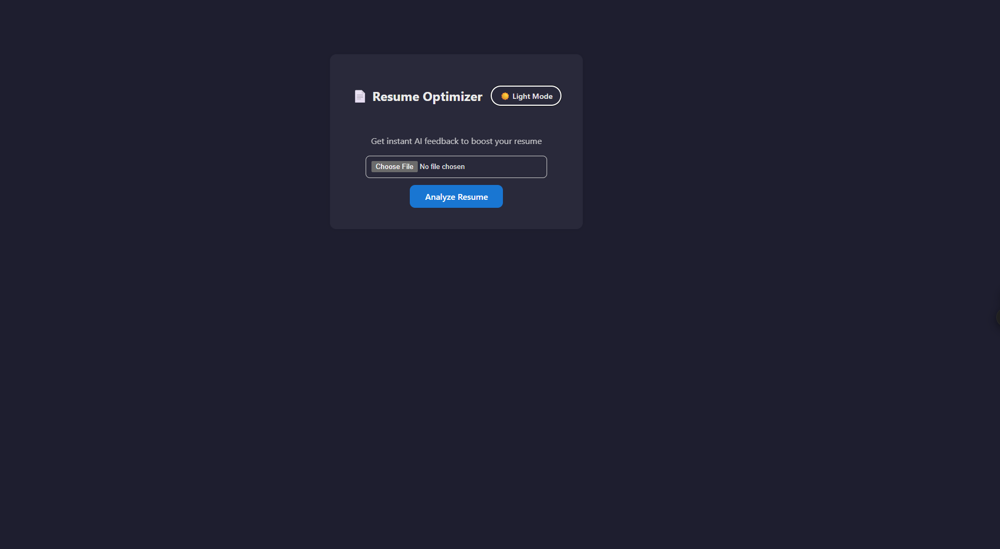

<h1 align="center">🚀 AI Resume Optimizer</h1>
<p align="center">
  An intelligent resume analyzer using <strong>Google Gemini Pro</strong> and <strong>Flask + React</strong>
</p>

<p align="center">
  
  
  
  
</p>

---

## 🧠 Overview

This project allows users to:
- 📤 Upload their resume (PDF)
- 🔍 Extract text using OCR
- 🤖 Analyze with **Google Gemini Pro**
- 📝 Receive a **score** and **3 detailed suggestions**
- 🎨 See the output in a **clean UI** with **dark mode**, **score bar**, and **PDF download**

---

## 📁 Project Structure

```bash
resume-optimizer-ai/
├── resume_ui/
├── resume-optimizer/
│   └── main.py
└── README.md
```

---

## ✨ Features

- ✅ Upload and analyze any PDF resume  
- 🔍 Tesseract OCR for robust text extraction  
- 🧠 Google Gemini Pro for smart suggestions  
- 🌗 Dark/light theme toggle  
- 📈 Score bar with visual feedback  
- 🧾 Wrapped output and preformatted content  
- 🖨️ Download feedback as a PDF  

---

## 🛠️ Backend Setup (Flask + Python)

### 1️⃣ Create virtual environment

```bash
cd resume-optimizer
python -m venv venv
```

### 2️⃣ Activate virtual environment

- **Windows**:
  ```bash
  venv\Scripts\activate
  ```
- **Mac/Linux**:
  ```bash
  source venv/bin/activate
  ```

### 3️⃣ Install dependencies

```bash
pip install -r requirements.txt
```

### 4️⃣ Install Tesseract OCR

- [🔗 Download Tesseract](https://github.com/tesseract-ocr/tesseract)
- Add to system path
- Set this in `main.py`:

```python
pytesseract.pytesseract.tesseract_cmd = r'C:\Program Files\Tesseract-OCR\tesseract.exe'
```

### 5️⃣ Run Flask server

```bash
python main.py
```

---

## 🌐 Frontend Setup (React)

### 1️⃣ Install dependencies

```bash
cd resume_ui
npm install
```

### 2️⃣ Run development server

```bash
npm run dev
```

Open: [http://localhost:5173](http://localhost:5173)

---

## 🔑 Gemini API Setup

1. Visit: [Google AI Studio](https://makersuite.google.com/app)  
2. Generate API Key from: [https://aistudio.google.com/app/apikey](https://aistudio.google.com/app/apikey)  
3. In `main.py`:

```python
import google.generativeai as genai

genai.configure(api_key="YOUR_API_KEY")
```

---

## 🧠 Bonus Features

- ✅ `white-space: pre-wrap` output formatting  
- 🌗 Light/Dark theme toggle  
- 📄 PDF feedback download  
- 📊 Score progress bar  
- 💥 Output auto-wrap and scroll  
- 🔴 Graceful error handling with messages  

---

## 📦 Tech Stack

| Technology     | Description                        |
|----------------|------------------------------------|
|      | Flask backend server          |
|        | Interactive UI frontend       |
|  | Extracts text from resume     |
|  | AI analysis and suggestions   |
|             | Clean responsive styling      |

---

## 📸 Screenshots

| Upload Resume | Gemini AI Output |
|---------------|------------------|
|  |  |
|  |  |

---

## ⚙️ Useful Commands

```bash
pip freeze > requirements.txt
python main.py
npm run dev
```

---

## ⚠️ Notes

- Currently supports **PDF only**
- Avoid heavy resume designs
- Free Gemini API has **rate limits**
- Tesseract must be installed locally

---

## 📄 License

This project is licensed under the **MIT License**

---

## 🙌 Made with ❤️ by Rakshit Awadhiya

If you like this project, ⭐ it and share!
